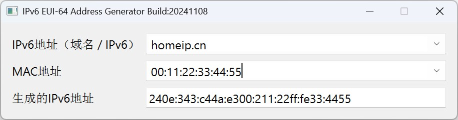

# IPv6 EUI-64 Address Generator



## 概述
本软件旨在帮助用户生成符合 EUI-64 标准的 IPv6 地址，特别适用于家用动态 IPv6 环境。用户可以通过提供最新的公网 IPv6 前缀（通过输入域名或 IPv6 地址），与指定的 MAC 地址组合生成完整的 IPv6 地址。软件提供了便捷的设置功能，支持管理常用的 IPv6 前缀、域名/IPv6 地址列表以及 MAC 地址，同时允许为 MAC 地址指定别名。

## 功能
- 自动解析域名以获取最新的公网 IPv6 前缀。
- 提供用户设置和管理常用的 IPv6 前缀和域名/IPv6 地址列表。
- 支持输入和管理多个 MAC 地址，并允许为每个 MAC 地址指定别名。
- 将 IPv6 前缀与 EUI-64 后缀组合生成完整的 IPv6 地址。

## 注意事项
- **动态前缀的限制**：如果 `config.json` 中设置的是固定的 IPv6 前缀而不是域名，则软件在生成 IPv6 地址时会使用该固定前缀。这样无法实现每次生成的 IPv6 地址都是最新的公网 IPv6 地址。只有使用域名解析时，软件才能自动获取最新的公网 IPv6 前缀并进行地址组合。
- 确保输入的 MAC 地址符合标准格式。

## 使用方法

1. **设置常用的 IPv6 前缀和域名/IPv6 地址**：
   - 在 `config.json` 中添加或编辑常用的 IPv6 前缀及域名/IPv6 地址列表，方便快速选择。

2. **设置和管理 MAC 地址**：
   - 输入 MAC 地址并可为其指定便于识别的别名，例如：
     - `00:1A:2B:3C:4D:5E` 别名：`家庭PC`
   - 支持添加和删除 MAC 地址。

3. **生成 IPv6 地址**：
   - 选择预设的 IPv6 前缀或输入域名/IPv6 地址，以及指定的 MAC 地址，软件将生成符合 EUI-64 标准的完整 IPv6 地址。

## 示例
### 示例 1：使用域名/IPv6 地址和已保存的 MAC 地址生成 IPv6 地址
- 域名/IPv6 地址：`example.com` 或 `2001:db8::`
- MAC 地址（别名：`家庭PC`）：`00:1A:2B:3C:4D:5E`
- 生成结果：`2001:db8::21a:2bff:fe3c:4d5e`（视解析结果而定）

## 系统需求
- Python 3.6 或更高版本
- 适用于 Linux、Windows、macOS 系统

## 安装
克隆项目并安装依赖项：
```bash
git clone https://github.com/haobinnan/IPv6_EUI-64_Address_Generator.git
cd IPv6_EUI-64_Address_Generator
```

## 使用
运行软件并根据提示管理 域名/IPv6 地址和 MAC 地址：
```bash
python IPv6_EUI-64_Address_Generator.py
```

## 许可证
本项目采用 [MIT License](LICENSE) 许可证开源。

## 联系
如有问题或建议，请联系 [haobinnan@gmail.com] 或访问 [GitHub 项目页面](https://github.com/haobinnan/IPv6_EUI-64_Address_Generator)。
